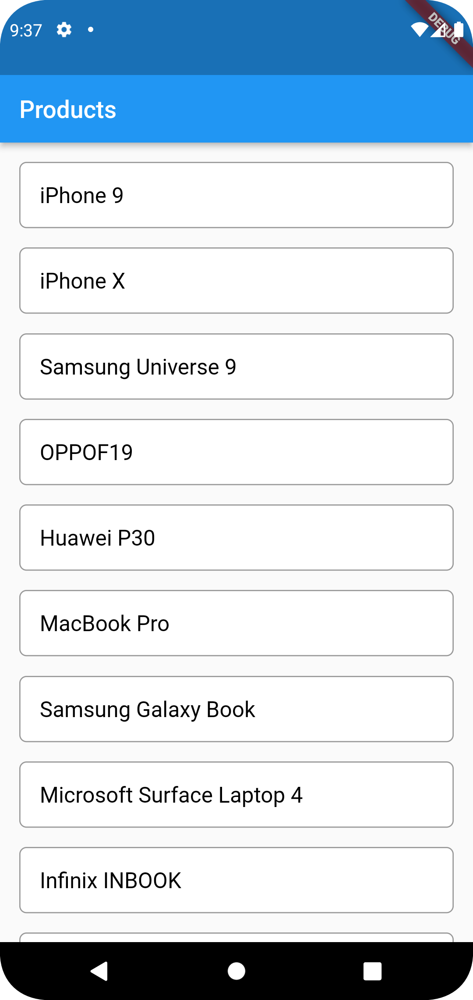
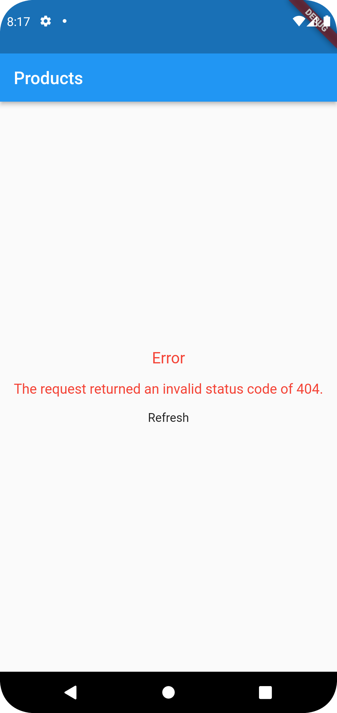

<!--
This README describes the package. If you publish this package to pub.dev,
this README's contents appear on the landing page for your package.

For information about how to write a good package README, see the guide for
[writing package pages](https://dart.dev/guides/libraries/writing-package-pages).

For general information about developing packages, see the Dart guide for
[creating packages](https://dart.dev/guides/libraries/create-library-packages)
and the Flutter guide for
[developing packages and plugins](https://flutter.dev/developing-packages).
-->

If you are working on a complex project you might be challenged to build a highly interactive UI or
a heavy business logic in a combination with the consumption of various data sources such as REST
APIs, Web Socket, Secured Storage, Shared Preferences, etc. To achieve this, you might need a
sophisticated architecture that facilitates your work during product development.

## Screenshot



## Getting started

Adding package #

```dart
rxdart_bloc: ^1.0.4
```

Importing package #

```dart
import 'package:rxdart_bloc/rxdart_bloc.dart';
```

## Usage

To use this plugin, add rxdart_bloc as a dependency in your pubspec.yaml file.

## Example

Here are an example that show you how to use this plugin.

```dart
import 'package:flutter/material.dart';
import 'package:rxdart_bloc/bloc_provider.dart';

import 'products/bloc/products_bloc.dart';
import 'products/view/products_view.dart';

void main() {
  runApp(const MyApp());
}

class MyApp extends StatelessWidget {
  const MyApp({super.key});

  @override
  Widget build(BuildContext context) {
    return MaterialApp(
      title: 'Flutter rxdart_bloc example',
      home: BlocProvider(bloc: ProductsBloc(), child: const ProductsView()),
    );
  }
}
```

```dart

import 'package:flutter/material.dart';
import 'package:rxdart_bloc/rxdart_bloc.dart';

import '../bloc/products_bloc.dart';
import '../model/products_response_model.dart';
import 'widget/products_item_widget.dart';

class ProductsView extends StatefulWidget {
  const ProductsView({Key? key}) : super(key: key);

  @override
  State<ProductsView> createState() => _ProductsViewState();
}

class _ProductsViewState extends State<ProductsView> {
  ProductsBloc bloc = ProductsBloc();

  @override
  void initState() {
    bloc = BlocProvider.of<ProductsBloc>(context);
    bloc.getProducts();
    super.initState();
  }

  @override
  Widget build(BuildContext context) {
    return Scaffold(
      appBar: AppBar(title: const Text('Products'),),
      body: StreamBuilder<GetAllProductsResponseModel>(
          stream: bloc.successStream,
          builder: (context, snapshot) {
            return StreamingResult(
              subject: bloc.requestStateSubject,
              successWidget: ListView.builder(
                  itemCount: snapshot.data?.products?.length,
                  padding: const EdgeInsets.all(16),
                  itemBuilder: (context, index) {
                    return ProductsItemWidget(
                      content: snapshot.data?.products?[index],
                    );
                  }),
              retry: () =>
                  bloc.getProducts(),
            );
          }
      ),
    );
  }

}
```

## Additional information

Tell users more about the package: where to find more information, how to
contribute to the package, how to file issues, what response they can expect
from the package authors, and more.
