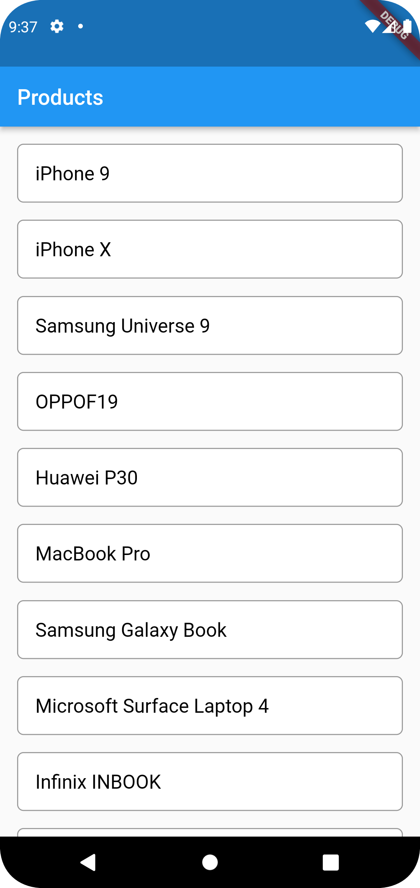
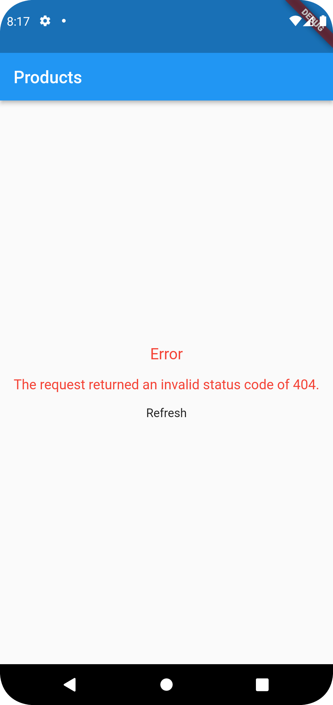
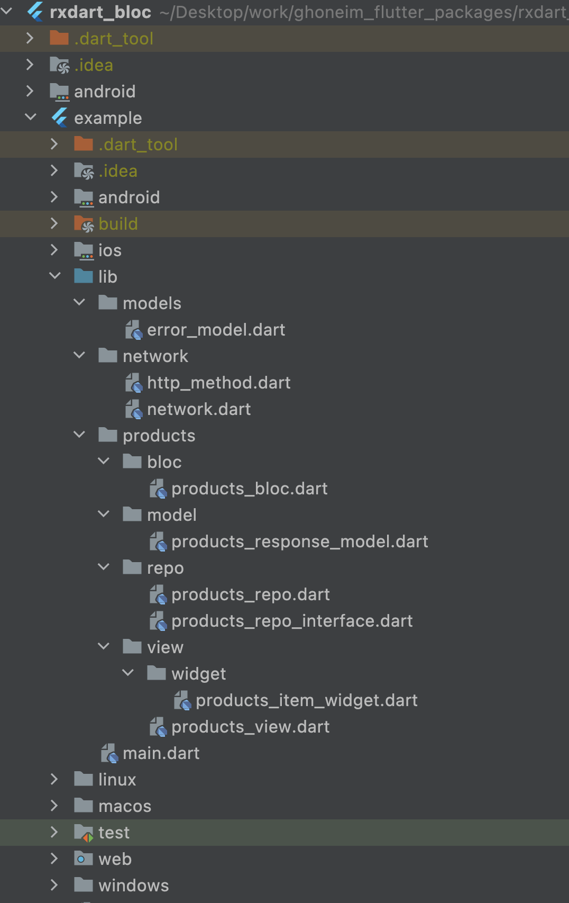
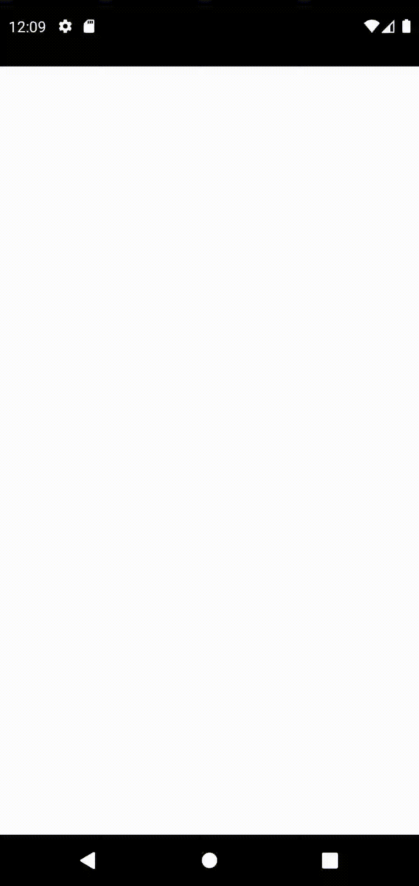
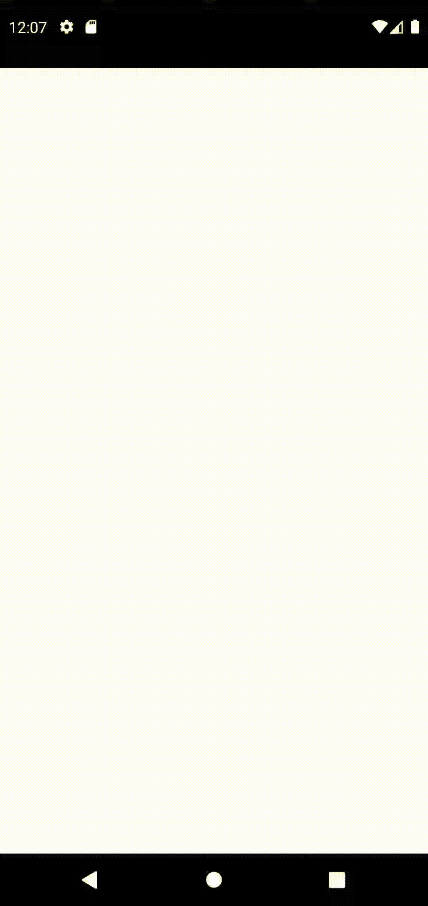

If you are working on a complex project you might be challenged to build a highly interactive UI or
a heavy business logic in a combination with the consumption of various data sources such as REST
APIs, Web Socket, Secured Storage, Shared Preferences, etc. To achieve this, you might need a
sophisticated architecture that facilitates your work during product development.

## Screenshot

|           SUCCESS           |           ERROR           |           ARCH           |
|:---------------------------:|:-------------------------:|:------------------------:|
|  |  |  |
|  |  |                          |


## Getting started

With `null-safety`

```dart
      dependencies:
        rxdart_bloc: ^1.0.8+1
```
Add the dependency to your project and start using **rxdart_bloc** #

Importing the package #

```dart
import 'package:rxdart_bloc/rxdart_bloc.dart';
```

## Usage

To use this plugin, add rxdart_bloc as a dependency in your pubspec.yaml file.

## Example

Here are an example that show you how to use this plugin.

## main.dart
```dart
import 'package:flutter/material.dart';
import 'package:rxdart_bloc/bloc_provider.dart';

import 'products/bloc/products_bloc.dart';
import 'products/view/products_view.dart';

void main() {
  runApp(const MyApp());
}

class MyApp extends StatelessWidget {
  const MyApp({super.key});

  @override
  Widget build(BuildContext context) {
    return MaterialApp(
      title: 'Flutter rxdart_bloc example',
      home: BlocProvider(bloc: ProductsBloc(), child: const ProductsView()),
    );
  }
}
```
## products_view.dart
```dart

import 'package:flutter/material.dart';
import 'package:rxdart_bloc/rxdart_bloc.dart';

import '../bloc/products_bloc.dart';
import '../model/products_response_model.dart';
import 'widget/products_item_widget.dart';

class ProductsView extends StatefulWidget {
  const ProductsView({Key? key}) : super(key: key);

  @override
  State<ProductsView> createState() => _ProductsViewState();
}

class _ProductsViewState extends State<ProductsView> {
  late ProductsBloc _bloc;

  @override
  void initState() {
    bloc = BlocProvider.of<ProductsBloc>(context);
    bloc.getProducts();
    super.initState();
  }

  @override
  Widget build(BuildContext context) {
    return Scaffold(
      appBar: AppBar(title: const Text('Products'),),
      body: StreamBuilder<GetAllProductsResponseModel>(
          stream: bloc.successStream,
          builder: (context, snapshot) {
            return StreamingResult(
              subject: bloc.requestStateSubject,
              successWidget: ListView.builder(
                  itemCount: snapshot.data?.products?.length,
                  padding: const EdgeInsets.all(16),
                  itemBuilder: (context, index) {
                    return ProductsItemWidget(
                      content: snapshot.data?.products?[index],
                    );
                  }),
              retry: () =>
                  bloc.getProducts(),
            );
          }
      ),
    );
  }

}
```

## products_bloc.dart
```dart
import 'package:rxdart_bloc/rxdart_bloc.dart';
import '../../../network/network.dart';
import '../../models/error_model.dart';
import '../model/products_response_model.dart';
import '../repo/products_repo.dart';

class ProductsBloc extends BaseBloc
with RxdartBlocState<GetAllProductsResponseModel, ErrorModel> {
BehaviorSubject<RequestState> requestStateSubject = BehaviorSubject.seeded(
RequestState(status: RequestStatus.init, message: 'INITIAL'));
final ProductsRepo _countriesRepo =
ProductsRepo(Network('https://dummyjson.com/'));

Future getProducts() async {
requestStateSubject.sink
.add(RequestState(status: RequestStatus.loading, message: 'LOADING'));

    var model = await _countriesRepo.getProducts();
    if (model is GetAllProductsResponseModel) {
      super.successSubject.sink.add(model);
      requestStateSubject.sink
          .add(RequestState(status: RequestStatus.success, message: 'SUCCESS'));
    }
    if (model is ErrorModel) {
      super.errorSubject.sink.add(model);
      requestStateSubject.sink.add(RequestState(
          status: RequestStatus.error, message: model.message ?? ''));
    }
}

@override
void dispose() {
requestStateSubject.close();
}
}
```
## products_repo_interface.dart
```dart
import 'package:rxdart_bloc/base_model.dart';

abstract interface class ProductsRepoInterface {
  Future<BaseModel> getProducts();
}
```
## products_repo.dart
```dart
import 'package:rxdart_bloc/base_model.dart';
import '../../../network/network.dart';
import '../../models/error_model.dart';
import '../model/products_response_model.dart';
import 'products_repo_interface.dart';

class ProductsRepo implements ProductsRepoInterface {
  final Network _network;
  ProductsRepo(this._network);

  @override
  Future<BaseModel> getProducts() async {
    try {
      var response =
          await _network.request(HttpMethod.get, endpoint: 'products');
      return GetAllProductsResponseModel.fromJson(response?.data);
    } catch (e) {
      return ErrorModel.fromJson(e as dynamic);
    }
  }
}
```

## rxdart_bloc widgets

## BlocProvider
**BlocProvider** is a Flutter widget which provides a bloc to its children.

```dart

BlocProvider(bloc: ProductsBloc(), child: const ProductsView());

```

## MultiBlocProvider
**MultiBlocProvider** is a Flutter widget which provides a multi blocs to their children.

```dart
MultiBlocProvider<List<BaseBloc>>(
  blocs: [
      Bloc1(),
      Bloc2(),
  ], child: const ProductsView()
);
```
## StreamingResult
**StreamingResult** is a Flutter widget which returns the result of request streaming. you can provide your custom **initWidget, successWidget, emptyWidget, errorWidget, retry function**

```dart

StreamingResult(
subject: _bloc.requestStateSubject,
// initWidget: const Center(child: Text('Initial')),
successWidget: ListView.builder(
itemCount: snapshot.data?.products?.length,
padding: const EdgeInsets.all(16),
itemBuilder: (context, index) {
return ProductsItemWidget(
content: snapshot.data?.products?[index],
);
}),
// emptyWidget: const Center(child: Text('Empty')),
// errorWidget: const Center(child: Text('Error')),
retry: () => _bloc.getProducts(),
);
```
## Declare bloc
```dart
  late ProductsBloc _bloc;

```
## Initialize bloc
```dart
  @override
  void initState() {
    _bloc = BlocProvider.of<ProductsBloc>(context);
    _bloc.getProducts();
    super.initState();
  }
```

## Improve

Help me by reporting bugs, **submit new ideas** for features or anything else that you want to share.

- Just [write an issue](https://github.com/MohamedGhoneem/rxdart_bloc/issues) on GitHub. ✏️
- And don't forget to hit the **like button** for this package ✌️

## More

Check out my other useful packages on [pub.dev](https://pub.dev/publishers/ghoneem.com/packages)

